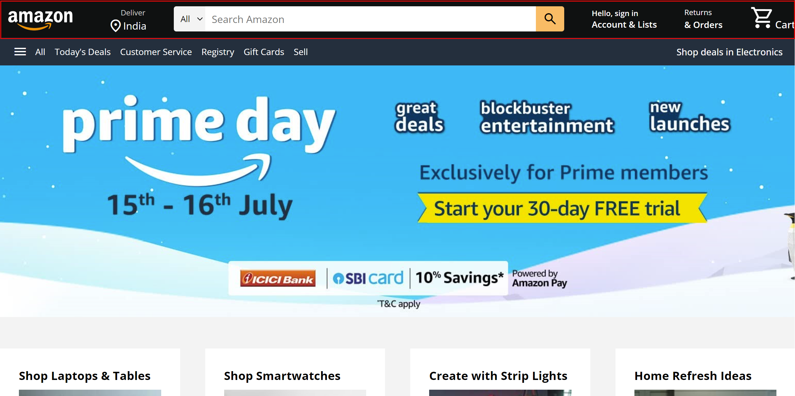
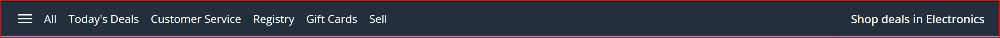
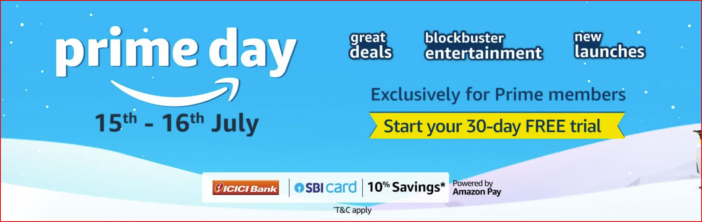
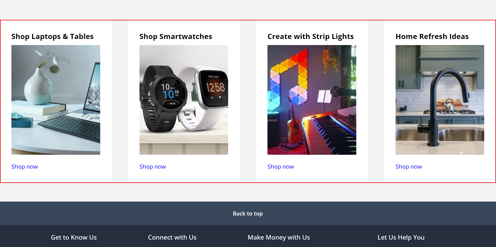
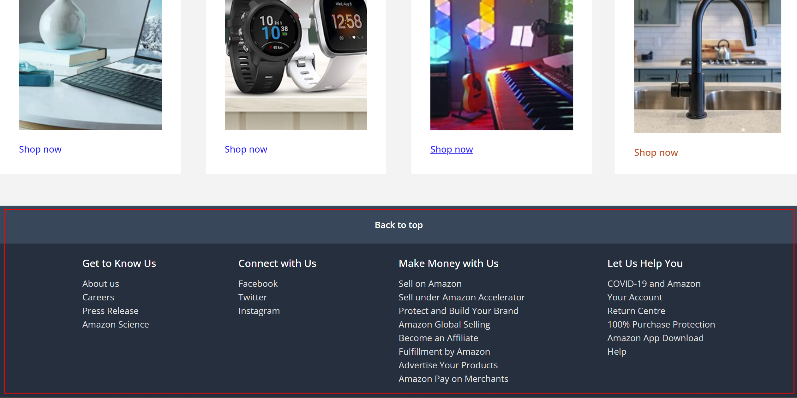

# Mohit0120-Weekly-Test-5-CSS-Properties

In complete UI the font used is Open Sans and scroll behaviour has been set to smooth for smooth transition during scroll and call to action link click

1. Navbar

this navbar has been made inside header tag using nav tag and inside nav tag conatains five divs

- nav-logo
- address
- nav-search
- sign-in
- returns
- cart
  these divs contains the content of navbar and this is made using property display flex in which items are centered vertically using align-item property with value center and justify-content with value space-between and all the basic styling is done like background color, icons, border-radius with various border properties, etc.

2.  Banner

similar to the navbar banner is also made using display flex to align the content horizontally and vertically and all the internal divs like-

- banner
- banner-content - panel - links - deals
  all the content in the banner was text. so, the tags used are span, a, ul, li.
  and the banner is styled using background colors, spacing horizontally, etc.

3. hero-section

this section contains a image which is applied using css properties like background-image, height, background positoin and background size to make the image appear on the page.

4. shop-section

  The UI consists of a shopping section with a light grey background that centers everything. Inside, a grid layout adapts to screen size, displaying product cards for each item (like laptops or smartwatches). Each card has a white background, containing a product image, title, and a shop link.

  When you hover over a card, it grows slightly to create a more interactive feel. The images stretch to fit the width of the card, and the titles are clearly displayed underneath. The shop links turn from blue to orange when hovered.

  As you scroll, each card flips into place with smooth animations, giving a dynamic shopping experience.

5. footer

 1. "Back to top" Button: At the top of the footer, there’s a button created using an anchor tag. It is centered horizontally, with a dark blue background and white text. It uses padding and a bold font to make it stand out.

 2. Footer Sections: Below the "Back to top" button, there are multiple sections (like "Get to Know Us" or "Connect with Us"). These are organized into four columns using an unordered list (ul) with headings (h3) for each section. The layout is handled by flexbox, ensuring even spacing across the width.

 3. Links: Inside each section, there are list items (li) containing links. These links are light grey by default and underlined on hover, giving a visual cue when a user interacts with them.

 4. Background Colors: The top part ("Back to top") has a darker background (#37475a), while the main footer has a slightly lighter dark blue background (#232f3e) to create a visual separation.

 The overall structure uses flexbox to ensure alignment and spacing, and the color scheme is dark with white/light text for contrast.

 summary -  Navbar: The navbar is created using flexbox for horizontal alignment. It contains     elements like logo, address, search, sign-in, returns, and cart, all styled with background color, icons, and borders.

            Banner: This section also uses flexbox to arrange text content like links and deals, styled with background colors and spacing.

            Hero Section: Displays a background image, positioned using CSS properties for size and alignment.

            Shop Section: A grid-based shopping section with product cards for items like laptops and smartwatches. The cards have hover effects, changing size and color, and use smooth flip animations on scroll.

            Footer: Includes a "Back to top" button and multiple sections organized into four columns. Links are light grey, and the color scheme features dark backgrounds with white text, spaced using flexbox for a balanced layout.